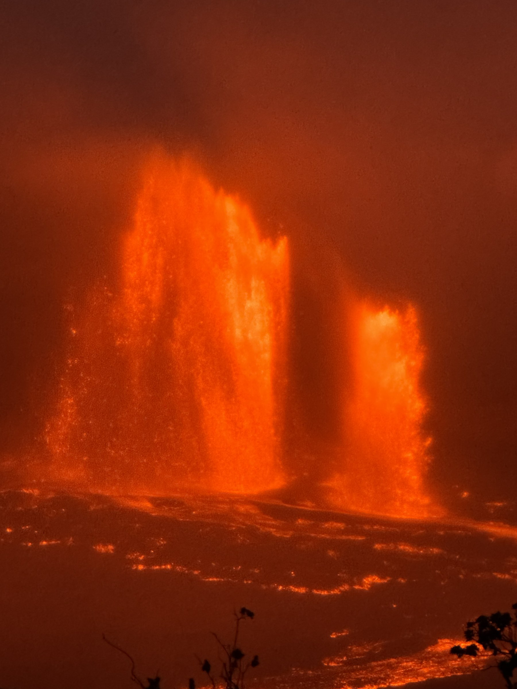
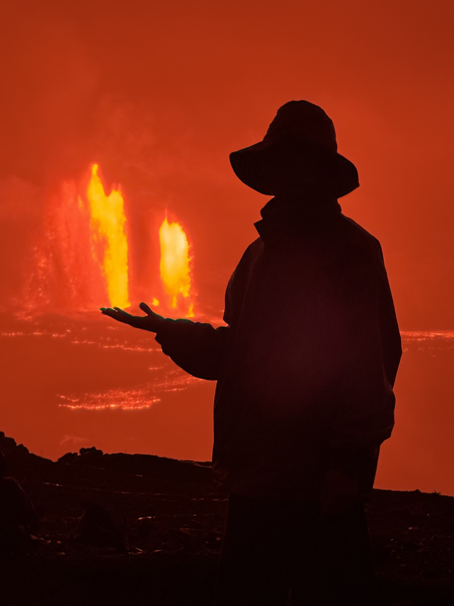

Most people who see a Kīlauea eruption are at the right place by accident — they happen to be on the Big Island when one starts. I didn't want to leave it to luck. So before booking, I spent a while watching the [USGS data](https://www.usgs.gov/volcanoes/kilauea/volcano-updates), picked a window, and we caught [**Episode 42**](https://www.usgs.gov/volcanoes/kilauea/science/eruption-information).

A reality check first. After more than a year of continuous activity, Kīlauea's eruption intervals are getting longer. USGS has noted that the trigger conditions are getting stricter. No methodology guarantees you a sighting — it's still partly Pele's call. What you can do is improve the odds and design your trip around the buffer you'll need.

Here's the signal stack we used.

## 1. When to book

[USGS posts an updated eruption forecast daily](https://www.usgs.gov/volcanoes/kilauea/volcano-updates), around 8–10am Hawaii time. The forecast gives a predicted window for the next likely eruption.

The right time to book a trip is when three conditions are true at once:

- The last eruption was about a week ago.
- The **tilt** slope (more on this below) has been relatively stable.
- USGS's predicted window has narrowed to **4–7 days**.

When you book, your itinerary should bracket the predicted window with at least a couple of days of buffer on each side. Eruptions slip earlier or later — the slip is the most common reason people miss it.

Our trip is the example. USGS was predicting an eruption on days 12–14 of the month. We booked days 10–16 of that month — two days of buffer before the window, two after. The eruption hit on day 15, one day past USGS's forecast. The buffer caught it.

Booking this close to your travel date is more expensive than booking weeks out. That premium is the cost of the higher odds.

## 2. How to read the tilt

Conceptually: an eruption needs the volcano's **tilt** — a measure of ground deformation as magma accumulates — to reach a threshold. The threshold isn't a fixed number. It's relative to the previous eruption's peak tilt.

What that means in practice:

- The USGS forecast you see is a daily-updated guess, calibrated against the recent tilt slope.
- Tilt rises and falls along the way — not a smooth climb.
- If today's real-time tilt unexpectedly drops, the forecast date will likely slip back.
- The closer you get to the predicted day, the more you want to be checking real-time tilt rather than yesterday's published forecast.

## 3. On the island, before things get hot

When tilt is still far from the previous eruption's peak — or the red glow in the live feed is faint or absent — you don't have to do anything. Go snorkel, drive Mauna Kea, eat at the Hilo farmers' market. Check the data once or twice a day and otherwise be on vacation.

USGS publishes a [YouTube live feed](https://youtube.com/@usgs/streams) of the active crater. The visual feed is faster to parse than the tilt graphs — a glance at the glow tells you whether things are heating up.

## 4. The signs that something is about to happen

Once tilt is approaching the previous eruption's peak **and** the live feed is glowing strongly, raise your check frequency. Watch real-time tilt: rising means closer; falling means the date is slipping. The visible sequence we watched in the live feed, in order of urgency:

1. **Occasional lava splashes or brief overflows.** Getting close. Not yet. Don't drive in.
2. **Sustained lava fountaining** — fountains that don't retract back below the rim. This is the start.
3. **Fountain height increasing + real-time tilt dropping rapidly.** It's happening. Leave now.

We made the call on signal #3.

## 5. The viewing spot

Navigate to **Devastation Trail** and follow the crowd. Of the spots people gather at, **D point** had the best view of the active fountains.

## 6. Resources

Official USGS pages I checked regularly:

- [**Kīlauea Volcano Updates**](https://www.usgs.gov/volcanoes/kilauea/volcano-updates) — the main daily forecast and current alert level.
- [**HVO Observatory Messages**](https://www.usgs.gov/observatories/hvo/observatory-messages) — short, real-time status updates as episodes progress.
- [**USGS YouTube livestreams**](https://youtube.com/@usgs/streams) — the visual feed of the active summit crater.
- [**Kīlauea webcams**](https://www.usgs.gov/volcanoes/kilauea/webcams) — still-image cameras at multiple angles (useful when the YouTube stream is down).
- [**Kīlauea eruption episode timeline**](https://www.usgs.gov/volcanoes/kilauea/science/eruption-information) — list of all episodes since the current cycle began in December 2024, with start/end timestamps.
- [**Volcano Notification Service**](https://volcanoes.usgs.gov/vns2/) — official USGS email alerts on activity changes; you can subscribe to just Kīlauea.

One non-USGS tool:

- **Volcano Call App** — phones your number when an eruption starts. The reason to install this is the 3am case: lava begins at night, you sleep through, your trip ends, you missed it. With the app, you wake up.

<figure>

</figure>

Mahalo to Pele for granting permission. The data tells you where to be; the timing is hers.
